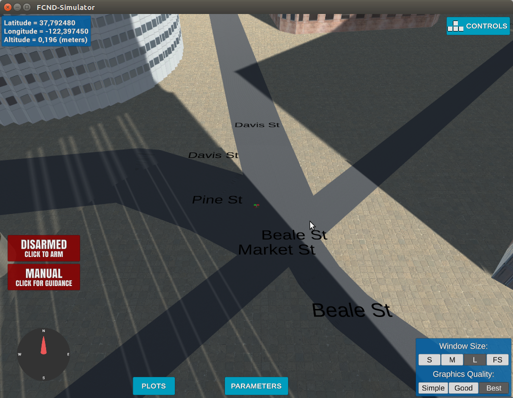
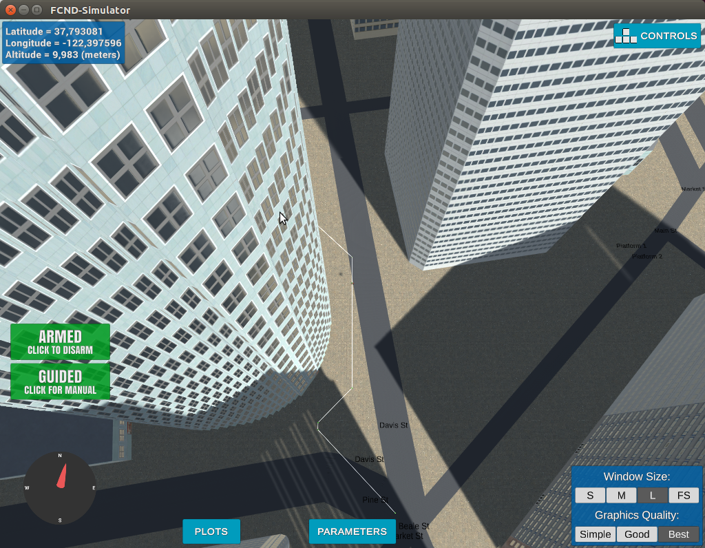

## Project: 3D Motion Planning


---


# Required Steps for a Passing Submission:
1. Load the 2.5D map in the colliders.csv file describing the environment.
2. Discretize the environment into a grid or graph representation.
3. Define the start and goal locations.
4. Perform a search using A* or other search algorithm.
5. Use a collinearity test or ray tracing method (like Bresenham) to remove unnecessary waypoints.
6. Return waypoints in local ECEF coordinates (format for `self.all_waypoints` is [N, E, altitude, heading], where the drone’s start location corresponds to [0, 0, 0, 0].
7. Write it up.
8. Congratulations!  Your Done!

## [Rubric](https://review.udacity.com/#!/rubrics/1534/view) Points
### Here I will consider the rubric points individually and describe how I addressed each point in my implementation.  

---
### Writeup / README

#### 1. Provide a Writeup / README that includes all the rubric points and how you addressed each one.  You can submit your writeup as markdown or pdf.  

You're reading it! Below I describe how I addressed each rubric point and where in my code each point is handled.

### Explain the Starter Code

#### 1. Explain the functionality of what's provided in `motion_planning.py` and `planning_utils.py`
These scripts contain a basic planning implementation that includes...

As part of `backyardflyer` project the `motion_planning.py` contains the main code that will plan run the commmands to guide the drone. The programming paradigm in which the program is written doesn't rely on time to schedule the path of the drone however on event programming. There are several distinct events like "Take Off", "Landing", "Arming", etc. The program takes care the sequence of these events so that the it is still responsive, while it's moving, there's an unexpected obstacle. Also, the program is responsible for calling the planning function so that it can find a path between a starting and a goal location. Finding a path is done using a modified version of the `a_star` algorithm that it is defined in `planning_utils.py`.


**1.1 Minimal requirement is to modify the code in planning_utils() to update the A* implementation to include diagonal motions on the grid that have a cost of sqrt(2), but more creative solutions are welcome. Explain the code you used to accomplish this step.**

Very first, (A*) -- an algorithm that searches for a path in a search space that has the minimal cost. This can be done by visiting continuously to nearby nodes however ones that are closer to the goal given an estimate--heuristic. hence, the (A*) algorithm searches for a path to connect the initial position of the drone (start) to the goal position. The A* algorithm works on the 3D grid of a map and tries to find connections of a point on the grid to the next until the end goal. It connects two points through a third by forming a triangle. However, if we set the cost of the diagonal movement to sqrt(2) the algorithm will always choose the less costly one connecting the two points in a straight line with a cost of just 1. in order to implement it, we had to change the Action class to include the 4 new diagonal actions:

```
    NORTH = (-1, 0, 1)
    SOUTH = (1, 0, 1)
    EAST = (0, 1, 1)
    WEST = (0, -1, 1)
    
```

with a cost of sqrt(2). we had to change the method valid_actions() so that the algorithm can remove the costly diagonal actions of sqrt(2) (see pythagorean theorem) and prefer the less costly straight of 1. To do this we added the first 4 lines below:

    ```python

    if x - 1 < 0 or grid[x - 1, y] == 1:
        valid_actions.remove(Action.NORTH)
    if x + 1 > n or grid[x + 1, y] == 1:
        valid_actions.remove(Action.SOUTH)
    if y - 1 < 0 or grid[x, y - 1] == 1:
        valid_actions.remove(Action.WEST)
    if y + 1 > m or grid[x, y + 1] == 1:
        valid_actions.remove(Action.EAST)

    if x - 1 < 0 or y - 1 < 0 or grid[x - 1, y - 1] == 1:
            valid_actions.remove(Action.NORTHWEST)
    if x - 1 < 0 or y + 1 > m or grid[x - 1, y + 1] == 1:
            valid_actions.remove(Action.NORTHEAST)
    if x + 1 > n or y - 1 < 0 or grid[x + 1, y - 1] == 1:
            valid_actions.remove(Action.SOUTHWEST)
    if x + 1 > n or y + 1 > m or grid[x + 1, y + 1] == 1:
            valid_actions.remove(Action.SOUTHEAST)


    ```
    
Since if we are on a cell on a grid there are available 8 actions (4 additional diagonal ones), I should be able to remove them if they're invalid. And they are invalid if they contain an obstacle or are beyond the available grid.

I used this table below to help me complete the code (we're in the position (0,0)):

|   |       |   N  |      |   |
|---|-------|------|------|---|
|   | -1,-1 | -1,0 | -1,1 |   |
| W |  0,-1 | 0,0  | 0,1  | E |
|   |  1,-1 | 1,0  | 1,1  |   |
|   |       |  S   |      |   |


And here's a lovely image of my results (ok this image has nothing to do with it, but it's a nice example of how to include images in your writeup!)


### Implementing Your Path Planning Algorithm

#### 1. Set your global home position
Starting the motion planner program first saves the central location as: lat0,lon0 37.792480,-122.397450 In which it is then decoded in the in a local location. This is done in the following part:

```python
        # read Lattitude and Longitude as lat0, lon0 from colliders CSV file
        f = open("colliders.csv", "r")
        lat_str, lon_str = f.readline().split(',')
        lat0 = float(lat_str[5:])
        lon0 = float(lon_str[5:])
        f.close()
```


And here is a lovely picture of our downtown San Francisco environment from above!


#### 2. Set your current local position
we have set the local position relative to the global home position using the following line:

`current_local_pos = global_to_local(self.global_position,self.global_home)`

we have previously set the home position in the line:

`self.set_home_position(lon0, lat0, 0)`

The lan0 and lat0 where retrieved from the .csv file.


#### 3. Set grid start position from local position
This is another step in adding flexibility to the start location.

```
        # starting point on the grid (grid center)
        grid_start = (-north_offset, -east_offset)
        # converting start position to current position rather than map center
        grid_start = (int(local_position[0] - north_offset), int(local_position[1] - east_offset))
        print(f"GRID_START = {grid_start}")
        
```

#### 4. Set grid goal position from geodetic coords

The goal is set using the two lines:

```
        # Set goal as some arbitrary position on the grid
        grid_goal = (-north_offset + 11, -east_offset + 11, TARGET_ALTITUDE)
        
        # adapting to set goal as latitude / longitude position and convert
        grid_goal = (100, 90)
        print(f"GRID_GOAL = {grid_goal}")
        
```

#### 5. Modify A* to include diagonal motion (or replace A* altogether)
we have modified the selection of next moves in the A* to include diagonal motions:

The actions includes four new ones (diagonal) with cost sqrt(2):

    NORTHWEST = (-1, -1, 1.42)
    NORTHEAST = (-1,1,1.42)
    SOUTHEAST = (1,1,1.42)
    SOUTHWEST = (1, -1, 1.42)

and in the valid_actions I have added:

```

    if (x - 1 < 0 and y - 1 < 0) or grid[x - 1, y - 1] == 1:
        valid_actions.remove(Action.NORTHWEST)
    if (x + 1 > n and y - 1 < 0) or grid[x + 1, y - 1] == 1:
        valid_actions.remove(Action.SOUTHWEST)
    if (x - 1 < 0 and y + 1 > m) or grid[x - 1, y + 1] == 1:
        valid_actions.remove(Action.NORTHEAST)
    if (x + 1 > n and y + 1 > m) or grid[x + 1, y + 1] == 1:
        valid_actions.remove(Action.SOUTHEAST)
        
```

#### 6. Cull waypoints 
we have used collinearity to prune the path. The prunning algorithm looks like this:

```
def prune_path(path):
    pruned_path = [p for p in path]
    i = 0

    while i < len(pruned_path) - 2:
        p1 = point(pruned_path[i])
        p2 = point(pruned_path[i+1])
        p3 = point(pruned_path[i+2])

        if collinearity_check(p1, p2, p3):
            pruned_path.remove(pruned_path[i+1])
        else:
            i += 1

    return pruned_path     
```

In collinearity, we are selecting continuous groups of points as three in each set, to see if they belong in a line. If it can be connected to a line then we replace the two waypoints with a single one (longer) and continue the search to see if we can add more way points to the same line. It helped to manage a relatively smooth route:




### Execute the flight
#### 1. Does it work?
We tried the suggested location of (long. = -122.402224, lat. = 37.797330) and the drone guided itself into it. for going back need to run from the goal position:

python motion_planning.py --lat 37.792480 --lon
 -122.397450
You can run any location you like by using the parameters lat,lon .

Also, note that the planning search takes more than 5 seconds which is the default time out limit. I changed the time out to 40 seconds:

```
    conn = MavlinkConnection('tcp:{0}:{1}'.format(args.host, args.port), timeout=600)
    drone = MotionPlanning(conn)
 
```

  
# Extra Challenges: Real World Planning

We can plan to do later in the course as per below.

For an extra challenge, consider implementing some of the techniques described in the "Real World Planning" lesson. You could try implementing a vehicle model to take dynamic constraints into account, or implement a replanning method to invoke if you get off course or encounter unexpected obstacles.


